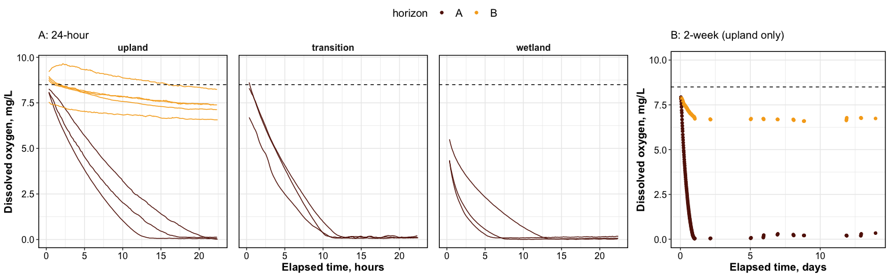
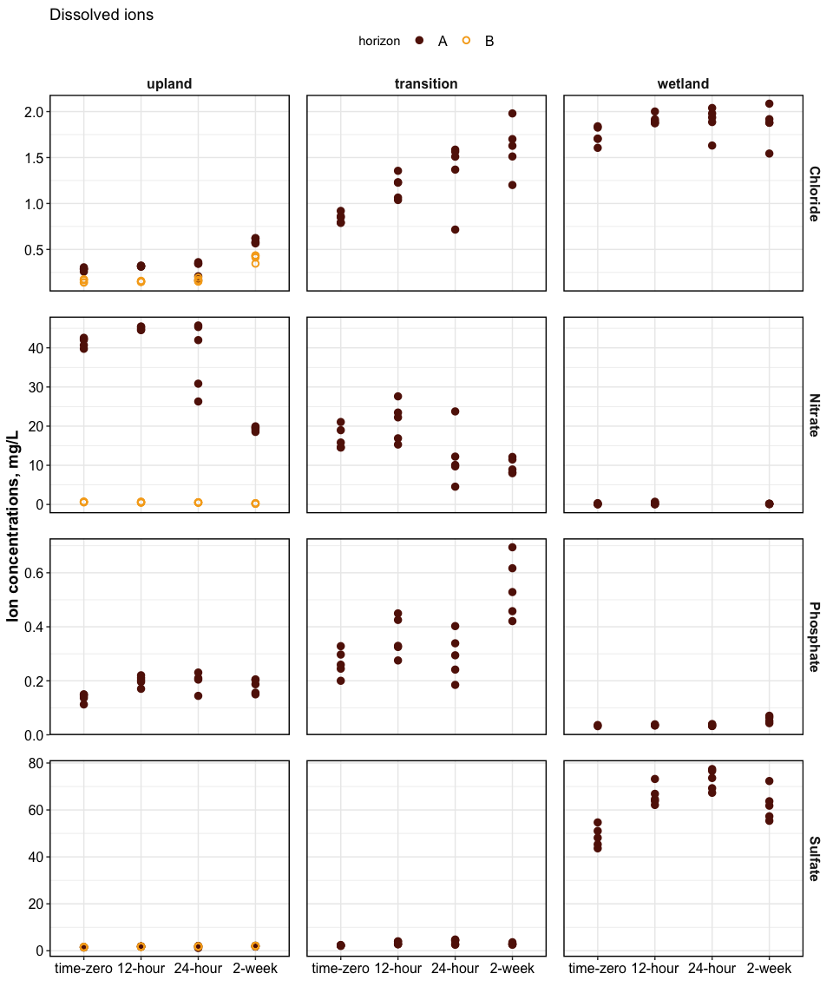
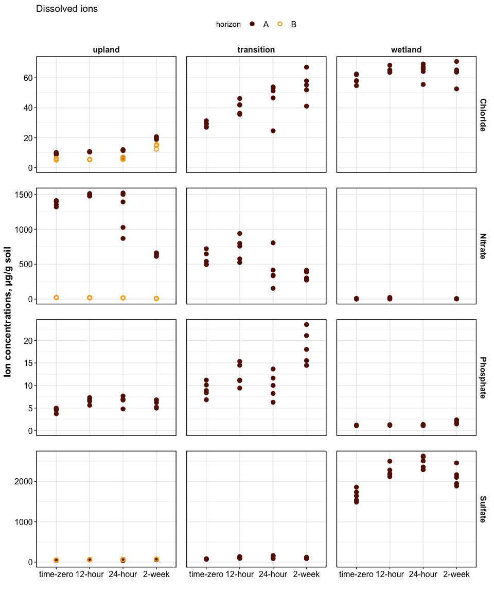
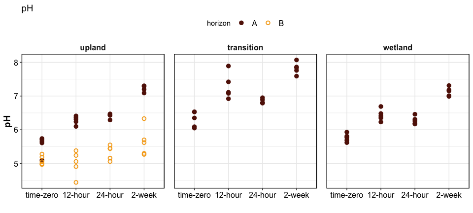

Time to anoxia
================

Soil samples were inundated with deionized water and incubated for
12-hr, 24-hr, or 2-wk. Dissolved oxygen was measured continuously during
the incubation. At the end of the incubation, the samples were
centrifuged and filtered, and analyzed for dissolved nutrients
(supernatant) and total nutrients (soil pellet).

------------------------------------------------------------------------

## Optode data (dissolved oxygen)

    ## $version1

<!-- -->

    ## 
    ## $version2_legend

<!-- -->

## Dissolved nutrients/chemistry

### Water extractable organic C

    ## $mg_l

<!-- -->

    ## 
    ## $ug_g

<!-- -->

### Dissolved ions

    ## $ions_mg_l

<!-- -->

    ## 
    ## $ions_ug_g

<!-- -->

### pH

<!-- -->

## Substrate induced respiration

<!-- -->

| type         | biomass_ug_100g |
|:-------------|----------------:|
| Transition-A |       14.020173 |
| Upland-A     |        9.358146 |
| Upland-B     |        3.945775 |

## Field data (Aqua TROLL)

Version 1

<!-- -->

Version 2

## <!-- -->

Session Info

Date run: 2024-02-26

    ## R version 4.2.1 (2022-06-23)
    ## Platform: x86_64-apple-darwin17.0 (64-bit)
    ## Running under: macOS Big Sur ... 10.16
    ## 
    ## Matrix products: default
    ## BLAS:   /Library/Frameworks/R.framework/Versions/4.2/Resources/lib/libRblas.0.dylib
    ## LAPACK: /Library/Frameworks/R.framework/Versions/4.2/Resources/lib/libRlapack.dylib
    ## 
    ## locale:
    ## [1] en_US.UTF-8/en_US.UTF-8/en_US.UTF-8/C/en_US.UTF-8/en_US.UTF-8
    ## 
    ## attached base packages:
    ## [1] stats     graphics  grDevices utils     datasets  methods   base     
    ## 
    ## other attached packages:
    ##  [1] googlesheets4_1.0.1 lubridate_1.9.2     forcats_1.0.0      
    ##  [4] stringr_1.5.0       dplyr_1.1.0         purrr_1.0.1        
    ##  [7] readr_2.1.4         tidyr_1.3.0         tibble_3.1.8       
    ## [10] ggplot2_3.4.3       tidyverse_2.0.0     tarchetypes_0.7.2  
    ## [13] targets_0.14.0     
    ## 
    ## loaded via a namespace (and not attached):
    ##  [1] tidyselect_1.2.0   xfun_0.42          gargle_1.2.0       colorspace_2.0-3  
    ##  [5] vctrs_0.5.2        generics_0.1.3     htmltools_0.5.3    yaml_2.3.5        
    ##  [9] utf8_1.2.2         rlang_1.1.1        pillar_1.8.1       glue_1.6.2        
    ## [13] withr_2.5.0        lifecycle_1.0.3    munsell_0.5.0      gtable_0.3.0      
    ## [17] cellranger_1.1.0   codetools_0.2-18   evaluate_0.16      labeling_0.4.2    
    ## [21] knitr_1.42         fastmap_1.1.0      callr_3.7.2        tzdb_0.3.0        
    ## [25] ps_1.7.1           fansi_1.0.3        highr_0.9          scales_1.2.1      
    ## [29] backports_1.4.1    farver_2.1.1       fs_1.5.2           hms_1.1.2         
    ## [33] digest_0.6.29      stringi_1.7.8      processx_3.7.0     cowplot_1.1.1     
    ## [37] grid_4.2.1         cli_3.6.0          tools_4.2.1        magrittr_2.0.3    
    ## [41] base64url_1.4      pkgconfig_2.0.3    ellipsis_0.3.2     data.table_1.14.4 
    ## [45] timechange_0.2.0   googledrive_2.0.0  rmarkdown_2.21     rstudioapi_0.14   
    ## [49] R6_2.5.1           soilpalettes_0.1.0 igraph_1.3.4       compiler_4.2.1

